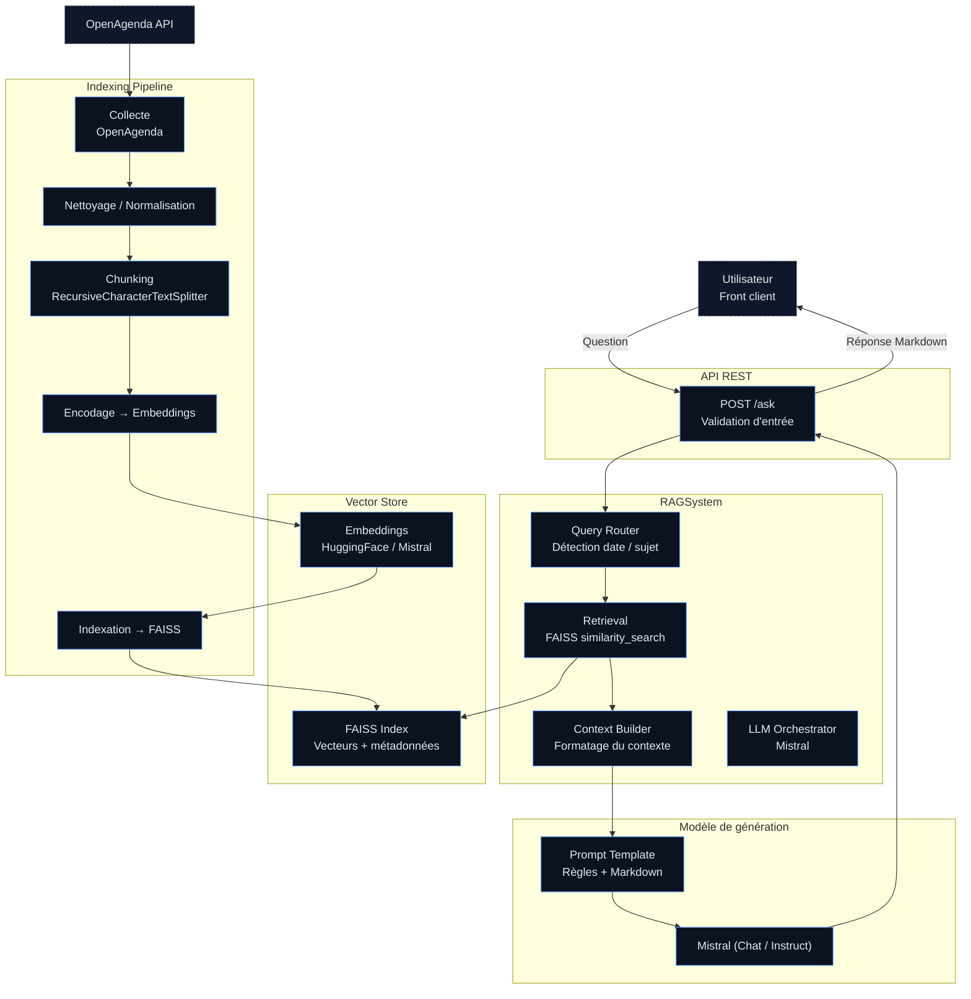

# 🎭 RAG POC - Assistant de Recommandation d'Événements Culturels

## 📋 Description

POC d'un système RAG (Retrieval-Augmented Generation) développé pour **Puls-Events**, permettant de répondre intelligemment aux questions sur les événements culturels à venir via un chatbot conversationnel.

Le système combine :
- **Recherche vectorielle** (FAISS) pour retrouver les événements pertinents
- **Génération de langage naturel** (Mistral AI) pour produire des réponses contextualisées
- **API REST** (FastAPI) pour exposer le service

---

## 🏗️ Architecture du Projet

```
RAG-POC/
├── data/                      # Données brutes et traitées
├── notebooks/                 
├── scripts/                   # Scripts de pipeline
│   ├── 1_collect_events.py   # Collecte depuis Open Agenda API
│   ├── 2_build_vector_database.py  # Création de l'index FAISS
│   ├── 3_run_rag.py          # Exécution du RAG en CLI
│   └── 4_run_chatbot.py      # Interface chatbot interactive
├── src/                       
│   ├── api/                  # Endpoints FastAPI
│   ├── chunking/             # Découpage des documents
│   ├── fetching/             # Récupération des événements
│   ├── rag/                  # Logique RAG principale
│   └── vector/               # Gestion index vectoriel FAISS
├── tests/                     # Tests unitaires et d'intégration
├── .env                       # Variables d'environnement
├── .gitignore
├── docker-compose.yml         # Orchestration Docker
├── Dockerfile                 # Image Docker de l'API
├── poetry.lock                
├── pyproject.toml             # Configuration Poetry et dépendances
├── poetry.lock                
└── README.md                  # Ce fichier
```


---


## 🧩 Schéma UML (Mermaid)




## 🚀 Installation et Configuration

### Prérequis

- **Python** : ≥ 3.12
- **Poetry** : Gestionnaire de dépendances ([Installation](https://python-poetry.org/docs/#installation))
- **Docker** : (Optionnel) Pour la conteneurisation ([Installation](https://docs.docker.com/get-docker/))
- **Clé API Mistral** : Obtenir sur [console.mistral.ai](https://console.mistral.ai/)

### Étape 1 : Cloner le Dépôt

```bash
git clone https://github.com/marintosti12/rag-poc.git
cd rag-poc
```

### Étape 2 : Installer les Dépendances avec Poetry

```bash
# Installer Poetry si nécessaire
curl -sSL https://install.python-poetry.org | python3 -

# Installer les dépendances du projet
poetry install
```

### Étape 3 : Configurer les Variables d'Environnement

Créez un fichier `.env` à la racine du projet :

```bash
MISTRAL_API_KEY=votre_cle_api_mistral

OPEN_AGENDA_API_KEY=votre_cle_open_agenda

# Zone géographique ciblée
TARGET_CITY=Paris

```
---

## 🔧 Utilisation

### Pipeline Complet : De la Collecte à l'API

#### 1️⃣ Collecter les Événements depuis Open Agenda

```bash
poetry run python scripts/1_collect_events.py
```

**Sortie attendue** : Fichier `data/raw_events.json` avec les événements récents

#### 2️⃣ Construire la Base Vectorielle FAISS

```bash
poetry run python scripts/2_build_vector_database.py
```

**Sortie attendue** : Index FAISS sauvegardé dans `data/faiss_index/`

#### 3️⃣ Tester le RAG en CLI

```bash
poetry run python scripts/3_run_rag.py
```

#### 4️⃣ Lancer le Chatbot Interactif (Optionnel)

```bash
poetry run python scripts/4_run_chatbot.py
```

Interface conversationnelle en ligne de commande.

---

### Lancer l'API REST (FastAPI)

#### Sans Docker

```bash
poetry run uvicorn src.api.main:app --host 0.0.0.0 --port 8000 --reload
```

Accédez à :
- **API** : http://localhost:8000
- **Documentation Swagger** : http://localhost:8000/docs
- **ReDoc** : http://localhost:8000/redoc

#### Avec Docker

```bash
docker build -t rag-poc-api .


```bash
docker-compose up --build
```

---

## 📡 Endpoints de l'API

### `POST /ask`

Envoyer une question au système RAG.

**Requête** :
```json
{
  "question": "Quels sont les événements jazz à Paris ce week-end ?",
  "max_results": 5
}
```

**Réponse** :
```json
{
  "question": "Quels sont les événements jazz à Paris ce week-end ?",
  "answer": "Voici les événements jazz à Paris ce week-end : ...",
  "sources": [
    {
      "title": "Festival Jazz à la Villette",
      "date": "2025-11-15",
      "location": "Parc de la Villette",
      "description": "..."
    }
  ],
  "response_time": 1.23
}
```

### `GET /health`

Vérifier l'état de l'API.

**Réponse** :
```json
{
  "status": "healthy",
  "faiss_index_loaded": true
}
```

---

## 🧪 Tests

### Exécuter les Tests Unitaires

```bash
# Tous les tests
poetry run pytest tests/

# Tests avec couverture
poetry run pytest tests/ --cov=src --cov-report=html

# Tests spécifiques
poetry run pytest tests/test_vector.py -v
```

### Tests d'Évaluation du Système

Le dossier `tests/` contient :
- **`test_dataset.json`** : Questions annotées de référence
- **`test_rag_quality.py`** : Évaluation automatique avec métriques (précision, rappel, F1)

Lancer l'évaluation :
```bash
poetry run python tests/test_rag_quality.py
```

---

## 📊 Métriques d'Évaluation

Le système est évalué selon :
- **Pertinence des documents récupérés** (Precision@K, Recall@K)
- **Qualité de génération** (BLEU, ROUGE, BERTScore)
- **Temps de réponse** (latence moyenne)

Résultats stockés dans `tests/evaluation_results.json`.

---

## 🛠️ Stack Technique

| Composant | Technologie | Version |
|-----------|-------------|---------|
| **Langage** | Python | ≥ 3.10 |
| **Gestionnaire de dépendances** | Poetry | - |
| **Framework API** | FastAPI | Latest |
| **Recherche vectorielle** | FAISS (CPU) | Latest |
| **Embeddings** | HuggingFace Sentence Transformers | `all-MiniLM-L6-v2` |
| **Génération LLM** | Mistral AI API | `mistral-large-latest` |
| **Orchestration LLM** | LangChain | Latest |
| **Conteneurisation** | Docker | - |
| **Tests** | Pytest | Latest |

---

## 📈 Choix Techniques Justifiés

### Pourquoi FAISS (CPU) ?
- Portabilité sur toute machine sans GPU
- Performance suffisante pour 10k-100k événements
- Intégration native avec LangChain

### Pourquoi Mistral AI ?
- Excellent rapport qualité/coût
- Support du français natif
- API simple et stable

### Pourquoi FastAPI ?
- Documentation automatique (Swagger)
- Performance élevée (async/await)
- Validation automatique avec Pydantic

### Pourquoi Poetry ?
- Résolution de dépendances déterministe
- Gestion simplifiée des environnements
- Build et publication standardisés

---

## 🔮 Perspectives d'Amélioration

### Court terme
- [ ] Ajout de filtres géographiques et temporels dans l'API
- [ ] Cache Redis pour les requêtes fréquentes
- [ ] Monitoring avec Prometheus/Grafana

### Moyen terme
- [ ] Fine-tuning d'un modèle d'embedding spécifique aux événements culturels
- [ ] Système de feedback utilisateur pour améliorer les réponses
- [ ] Support multi-langues (EN, ES, IT)

### Long terme
- [ ] Migration vers un vecteur store distribué (Qdrant, Pinecone)
- [ ] Intégration d'un système de réservation
- [ ] Interface web avec recommandations personnalisées

---


## 👤 Auteur

**Data Scientist Freelance**  
Projet : POC RAG pour Puls-Events  
Contact : [votre.email@example.com]

---

## 📚 Ressources Utiles

- [Documentation LangChain](https://python.langchain.com/docs/get_started/introduction)
- [FAISS GitHub](https://github.com/facebookresearch/faiss)
- [Mistral AI Docs](https://docs.mistral.ai/)
- [FastAPI Docs](https://fastapi.tiangolo.com/)
- [Open Agenda API](https://openagenda.com/fr/api)

---

**Dernière mise à jour** : Novembre 2025